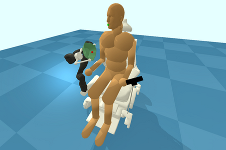

# Design of an Mask placement apparatus

## Introduction

The emergence of COVID-19 as a global pandemic has a significant impact on many people, especially those with disabilities. As an application of assistive technology, this project aims to develop a mask placement apparatus that would be used by people with mobility issues during the COVID-19 pandemic. Our solution revolves around using a wheelchair for a disabled person who cannot easily put on and take off masks. The design consists of a hardware system based on a power wheelchair with a robotic arm and a control interface using face/speech recognition. Our implementation contains several parts, including computer-aided design, facial and speech recognition software development, and experiments of the mask placement procedure in a 3D simulated environment. We demonstrate that the functionality of our design meets the proposed design requirements. 

## Required libraries
- gym, 
- pybullet
- numpy 
- keras
- tensorflow
- h5py
- smplx
- trimesh
- screeninfo
- opencv-python
- dlib

## Running:

Start the simulation:

`python mask_wearing.py`

Then the robot can be controlled by the following keys:

- `q`: exit the simulation
- `r`: reset the robot
- `f`: move the robot forward to place the mask
- `b`: move the robot back to release the mask

## Acknowledgments

This codebase evolved from the [Assistive Gym](https://github.com/Healthcare-Robotics/assistive-gym).
